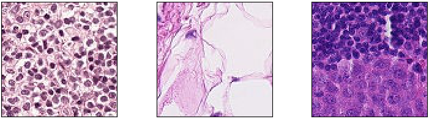
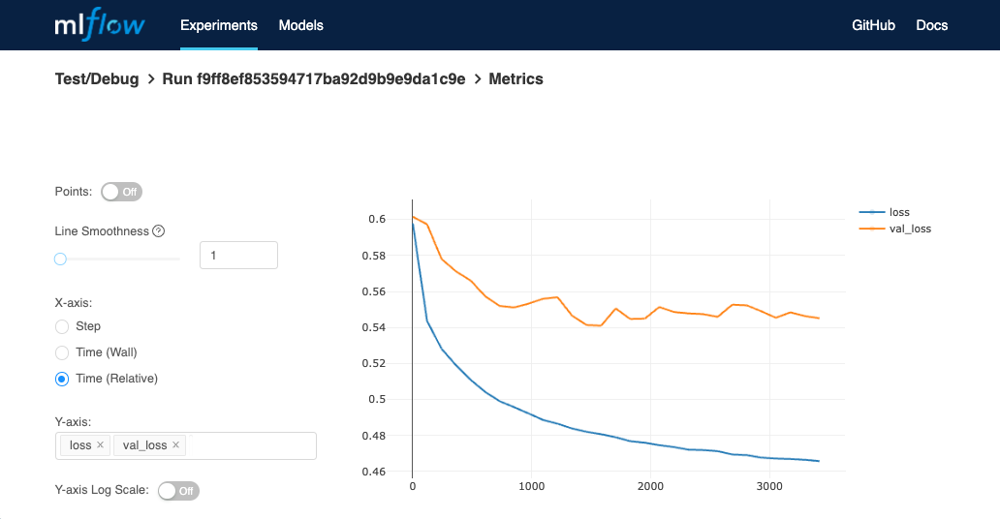

# py_tf2_gpu_dock_mlflow
_**Get new Python/Tensorflow/GPU models running quickly, and logging
performance and resulting model in MLflow, keeping everything in Docker via
MLflow Projects.**_

This is an example Python/Tensorflow2 setup using GPU and MLflow in a docker
container.  Python3, Tensorflow2, and the NVidia/GPU handling are entirely in
the container; the host system only needs the Nvidia driver and Docker
installed, and currently one runs the `mlflow run` script in a python
environment that has the `mlflow` package installed in it, purely for the
MLflow CLI to connect to your remote MLflow server and feed the MLproject to
the Docker container.  With those and just the `project_driver.bash` script,
technically you don't even need to clone this repo; you can reference it at
the top of that script.  But presumably the point is that you want to adapt
this repo's content to your own project - so, you know, clone the repo.  ;-)

An MLflow instance is looked for at the address in the `MLFLOW_TRACKING_URI`
environment variable per usual MLflow usage - see my 
[docker_mlflow_db](https://github.com/aganse/docker_mlflow_db) repo for an easy
Docker-based way to get that running quickly too.

In the default example here, we use the 
[patch_camelyon](https://www.tensorflow.org/datasets/catalog/patch_camelyon)
breast-cancer detection dataset from the Tensorflow datasets to train/test a
VGG166-based image classification model to detect metastatic tissue in
histopathologic scans of lymph node sections.  
While I have generally based the model configuration and
parameters in this demo upon several [papers on the topic](#References),
I don't have much familiarity with this medical topic itself, and have not yet
explored or optimized the modeling here so as-is the example is currently
overfit.  But the point here is to provide a convenient template to rapidly
throw together new models that use 
[Python](https://www.python.org)/[Tensorflow2](https://www.tensorflow.org)
running on GPUs in a [Docker](https://www.docker.com) container and log
the results to [MLflow](https://mlflow.org) using its "Project" functionality.
The models are logged to the MLflow registry and can be easily served via REST
API or downloaded from the registry into python code for further use.

The code and setup were initially based on [George Novack's 2020 article in
Towards Data Science, "Create Reusable ML Modules with MLflow Projects & Docker"](
https://towardsdatascience.com/create-reusable-ml-modules-with-mlflow-projects-docker-33cd722c93c4)
(thank you).  I've pulled things together into a single repo meant to use as a
template, added some new functionality (artifact logging, model registry, GPU
capability), and generalized it a bit.

<BR>
<sup>
[Veeling, Linmans, Winkens, Cohen, Welling - 2018](https://doi.org/10.1007/978-3-030-00934-2_24)
</sup>


## How to install/run

### TL;DR
0. note this repo has been written and tested assuming running on linux or
   macos.  it likely will not work out of the box in windows without a
   little tweaking.
1. have GPU and Docker already working on your system
2. have your MLFLOW_TRACKING_URI env var pointing to a running MLflow server
3. have your MLflow server's artifact storage directory and your data files
   accessible somewhere within /storage (which is volume-mapped into container)
4. git clone <this repo>, cd into it, create python env via `make env`
5. `make build`
6. `make load_tfdata` (if using the default tf dataset shown in this readme)
7. `make run` (only this step requires the python env, just for mlflow cli)


### First, ensure your system's all ready (TL;DR steps 1-3):
Per [Google's Tensorflow Docker documentation](https://www.tensorflow.org/install/docker),
check that your NVidia GPU device is present:
```
> lspci | grep -i nvidia
01:00.0 VGA compatible controller: NVIDIA Corporation TU104 [GeForce RTX 2080 SUPER] (rev a1)
01:00.1 Audio device: NVIDIA Corporation TU104 HD Audio Controller (rev a1)
01:00.2 USB controller: NVIDIA Corporation TU104 USB 3.1 Host Controller (rev a1)
01:00.3 Serial bus controller [0c80]: NVIDIA Corporation TU104 USB Type-C UCSI Controller (rev a1)
```
Then verify your nvidia-docker installation, e.g.:
```
> docker run --gpus all --rm nvidia/cuda nvidia-smi
Sun Jun  5 16:31:20 2022
+-----------------------------------------------------------------------------+
| NVIDIA-SMI 470.103.01   Driver Version: 470.103.01   CUDA Version: 11.4     |
|-------------------------------+----------------------+----------------------+
| GPU  Name        Persistence-M| Bus-Id        Disp.A | Volatile Uncorr. ECC |
| Fan  Temp  Perf  Pwr:Usage/Cap|         Memory-Usage | GPU-Util  Compute M. |
|                               |                      |               MIG M. |
|===============================+======================+======================|
|   0  NVIDIA GeForce ...  On   | 00000000:01:00.0 Off |                  N/A |
| 18%   26C    P8     4W / 250W |    134MiB /  7982MiB |      0%      Default |
|                               |                      |                  N/A |
+-------------------------------+----------------------+----------------------+

+-----------------------------------------------------------------------------+
| Processes:                                                                  |
|  GPU   GI   CI        PID   Type   Process name                  GPU Memory |
|        ID   ID                                                   Usage      |
|=============================================================================|
+-----------------------------------------------------------------------------+
```
If any trouble with those, that 
[Google Tensorflow Docker documentation](https://www.tensorflow.org/install/docker)
is really helpful.

Lastly set your MLFLOW_TRACKING_URI to whatever address you use for it, e.g.:
```
export MLFLOW_TRACKING_URI=http://localhost:5000
```
You might want to put that in your shell resource file (.bashrc for example).

As far as filesystem directories available, `/storage` is mapped into the
container (which can of course be changed to match your setup), so for example
in my setup I have `/storage/tf_data`, `/storage/mlruns`, and `/storage/data`
for my Tensorflow datasets, MLflow artifacts store (determined in the remote
MLflow server configuration), and "real" image data.


### Then follow these steps to run things (TL;DR steps 4-7):

1. git clone this repo and cd into it.
2. generate a python env, activate that env, and install mlflow into it.
   This can be done with `make env`.  After running that once, you don't
   need to do so again; on starting up work again you can re-enter the python
   environment as needed from this directory via `source .venv/bin/activate`.
3. `make build` :  Build the docker image; super quick.
4. `make load_tfdata` :  Download and setup the patch_camelyon dataset from
                   Tensorflow datasets.  This is only neccesary for runs using
                   a Tensorflow dataset (default example shown in this readme).
                   Note this default example dataset is 7.5GB and this step
                   can take a little while, but it's a one-time event.
5. `make run`   :  Run the training, which will progressively log state into
                   mlflow.  This too can take a while.  For context, on a
                   NVIDIA GeForce RTX 2080 SUPER it took about two hours.

Once the run is running, you should find metrics progress logging in your
MLFlow instance, something like this (yes this example is totally overfit):<BR>


The `make run` macro runs the `project_driver.bash` shell script, but a Python
script `project_driver.py` with mostly-corresponding functionality is included
here too.  However, importantly note:  as of this writing, it appears that GPU
usage can only be done for models in Docker containers in MLFlow Projects if
using the _shell script_ call to mlflow.  I.e. the shell command `mlflow` now
just recently takes a `gpus=all` argument, whereas the Python
`mlflow.projects.run()` method still does not do so yet.  Note that's strictly
about an issue with MLflow, not with Python or Tensorflow or Docker.


## References

About this patch_camelyon breast-cancer cell detection problem:
* <https://github.com/basveeling/pcam/blob/master/README.md#why-pcam>
* <https://www.diva-portal.org/smash/get/diva2:1597512/FULLTEXT01.pdf>
* <https://arxiv.org/pdf/1909.11870.pdf>
* <https://ieeexplore.ieee.org/document/9626116>
* <https://doi.org/10.1007/978-3-030-00934-2_24>

About relevant Tensorflow details in particular:
* <https://www.tensorflow.org/install/docker>
* <https://www.tensorflow.org/guide/keras/preprocessing_layers>
* <https://www.tensorflow.org/api_docs/python/tf/keras/metrics>
* <https://www.tensorflow.org/tutorials/structured_data/imbalanced_data>
* <https://www.tensorflow.org/api_docs/python/tf/data/Dataset>
* <https://www.tensorflow.org/tutorials/load_data/images>
* <https://www.tensorflow.org/api_docs/python/tf/keras/utils/image_dataset_from_directory>

About additional computational tools used here (Docker, MLflow, etc):
* <https://towardsdatascience.com/create-reusable-ml-modules-with-mlflow-projects-docker-33cd722c93c4>
* <https://towardsdatascience.com/using-mlflow-to-track-and-version-machine-learning-models-efd5daa08df0>
* <https://santiagof.medium.com/effortless-models-deployment-with-mlflow-2b1b443ff157>
* <https://towardsdatascience.com/step-by-step-vgg16-implementation-in-keras-for-beginners-a833c686ae6c#:~:text=VGG16%20is%20a%20convolution%20neural,vision%20model%20architecture%20till%20date.>
* <https://cosminsanda.com/posts/experiment-tracking-with-mlflow-inside-amazon-sagemaker>
* <https://stackoverflow.com/questions/48309631/tensorflow-tf-data-dataset-reading-large-hdf5-files>
* <https://github.com/tensorflow/io/issues/174>  (looks like TF-IO has built-in HDF5 reader?)

