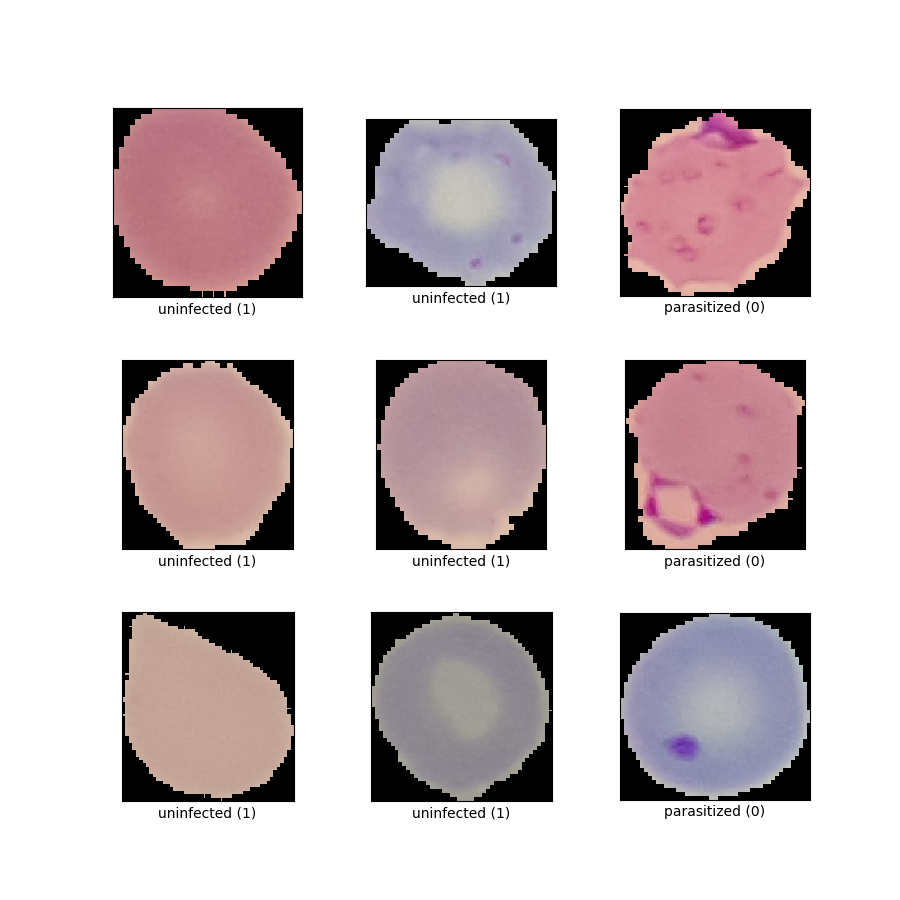

# py_tf2_gpu_dock_mlflow

_**Get new Python/Tensorflow/GPU models running quickly, and logging
performance and resulting model in MLflow, keeping everything in Docker via
MLflow Projects.**_

This [Python](https://www.python.org)/[Tensorflow2](https://www.tensorflow.org)
setup uses [MLflow](https://mlflow.org) with the GPU in a
[Docker](https://www.docker.com) container to train, evaluate, and log TF2
models to MLflow's model registry.  Logged models can be easily served via
REST API or downloaded from the registry into python code or their own new
Docker image for further use.

The training computation itself is handled entirely in the container; for
that the host system only needs the Nvidia driver and Docker installed.
However, currently to kick off the training one still needs a Python
environment with MLflow installed (and a clone of this repo assuming you want
to make your own changes to the problem).

The training script includes function definitions for loading training data
of different types (images from directory, tf-datasets, custom datafiles, etc)
and for the neural network specification, so those things are easily
experimented with independently of the rest of the code.  This repo's tools
spawns a Tensorflow model training in a self-contained Docker container with GPU
access and then logs its results and solution model into MLflow at the end so
one has a record of runs that can be compared.

In the default example implemented here, we use the 
[malaria](https://www.tensorflow.org/datasets/catalog/malaria)
detection dataset from the Tensorflow datasets to train/test a VGG166-based
image classification model to detect malaria parasite presence
in thin blood smear images.  A few arbitrary other options for neural network
definition are included in the code (follow the `convolutions` paraameter
which is actually "number of convolutional layers in the model".

<BR>


## How to install/run

### TL;DR
0. note this repo has been written and tested assuming running on linux.
   it likely will not work out of the box in windows.
1. have GPU and Docker already working on your system.  one option is starting
   the AWS instance described below and prepping it with the aws_ec2_install.bash
   script, but that's just an option, not necessary.
2. have your MLFLOW_TRACKING_URI env var pointing to a running MLflow server.
   one option is installing and starting the Dockerized MLflow server
   [docker_mlflow_db](https://github.com/aganse/docker_mlflow_db) that is
   installed in the aws_ec2_install.bash script.  but that's just an option,
   another MLflow server is fine too (must be version 2+).
3. either have your MLflow server's artifact storage directory and data files
   accessible somewhere within /storage/mlruns (which is volume-mapped into the
   container), or your MLflow instance configured to hold everything in S3.
4. git clone <this repo>, cd into it, create python env via `make env`
5. enter the python environment that was just made:  `source .venv/bin/activate`.
6. `make load_tfdata` (if using the default tf dataset shown in this readme) to
   download the data to /storage/tfdata.
8. then `make build` to create the training Docker container.
9. then `make run` (only this step requires the python env, just for mlflow cli).
   The first thing mlflow does on starting the run is to add the latest state of
   the train script and other files on top of the image built from the Dockerfile.
   For this reason the run may initially look like it's frozen while one cpu is
   pegged at 100%; but it's building that new image and that takes several minutes.
   The resulting new image takes the name of the one created by the `make build`
   command, and gets a hash-based label of the present git commit hash, looking
   like `<original_image_name>:abcde123`,


### First, ensure your system's all ready (TL;DR steps 1-3):
Per [Google's Tensorflow Docker documentation](https://www.tensorflow.org/install/docker),
check that your NVidia GPU device is present:
```
> lspci | grep -i nvidia
01:00.0 VGA compatible controller: NVIDIA Corporation TU104 [GeForce RTX 2080 SUPER] (rev a1)
01:00.1 Audio device: NVIDIA Corporation TU104 HD Audio Controller (rev a1)
01:00.2 USB controller: NVIDIA Corporation TU104 USB 3.1 Host Controller (rev a1)
01:00.3 Serial bus controller [0c80]: NVIDIA Corporation TU104 USB Type-C UCSI Controller (rev a1)
```
Then verify your nvidia-docker installation, e.g.:
```
> docker run --gpus all --rm nvidia/cuda nvidia-smi
Sun Jun  5 16:31:20 2022
+-----------------------------------------------------------------------------+
| NVIDIA-SMI 470.103.01   Driver Version: 470.103.01   CUDA Version: 11.4     |
|-------------------------------+----------------------+----------------------+
| GPU  Name        Persistence-M| Bus-Id        Disp.A | Volatile Uncorr. ECC |
| Fan  Temp  Perf  Pwr:Usage/Cap|         Memory-Usage | GPU-Util  Compute M. |
|                               |                      |               MIG M. |
|===============================+======================+======================|
|   0  NVIDIA GeForce ...  On   | 00000000:01:00.0 Off |                  N/A |
| 18%   26C    P8     4W / 250W |    134MiB /  7982MiB |      0%      Default |
|                               |                      |                  N/A |
+-------------------------------+----------------------+----------------------+

+-----------------------------------------------------------------------------+
| Processes:                                                                  |
|  GPU   GI   CI        PID   Type   Process name                  GPU Memory |
|        ID   ID                                                   Usage      |
|=============================================================================|
+-----------------------------------------------------------------------------+
```
If any trouble with those, that 
[Google Tensorflow Docker documentation](https://www.tensorflow.org/install/docker)
is really helpful.

Lastly set your MLFLOW_TRACKING_URI to whatever address you use for it, e.g.:
```
export MLFLOW_TRACKING_URI=http://localhost:5000
```
You might want to put that in your shell resource file (.bashrc for example).

As far as filesystem directories available, `/storage` is mapped into the
container (which can of course be changed to match your setup), so for example
in my setup I have `/storage/tf_data`, `/storage/mlruns`, and `/storage/data`
for my Tensorflow datasets, MLflow artifacts store (determined in the remote
MLflow server configuration), and "real" image data.


To kick off a training, you run the `mlflow run` script in a python environment
that has the `mlflow` package installed in it, purely for the MLflow CLI to
connect to your remote MLflow server and feed the MLproject to the Docker container.
With those and just the `project_driver.bash` script, technically you don't
even need to clone this repo; you could reference it at the top of that script.
But presumably the point is that you want to adapt this repo's content to your
own project - so, you know, clone the repo.  ;-)

An MLflow instance is looked for at the address in the `MLFLOW_TRACKING_URI`
environment variable per usual MLflow usage - see my 
[docker_mlflow_db](https://github.com/aganse/docker_mlflow_db) repo for an easy
Docker-based way to get that running quickly too.

### Then follow these steps to run things (TL;DR steps 4-7):

1. git clone this repo and cd into it.
2. generate a python env, activate that env, and install mlflow into it.
   This can be done with `make env`.  After running that once, you don't
   need to do so again; on starting up work again you can re-enter the python
   environment as needed from this directory via `source .venv/bin/activate`.
3. `make build` :  Build the docker image; super quick.
4. `make load_tfdata` :  Download and setup the malaria dataset from
                   Tensorflow datasets.  This is only neccesary for runs using
                   a Tensorflow dataset (default example shown in this readme).
                   Note this default example dataset is 7.5GB and this step
                   can take a little while, but it's a one-time event.
5. `make run`   :  Run the training, which will progressively log state into
                   mlflow.  This too can take a while.  For context, on a
                   NVIDIA GeForce RTX 2080 SUPER it took about two hours.

Once the run is running, you should find metrics progress logging in your
MLFlow instance, something like this (yes this example is totally overfit):<BR>


The `make run` macro runs the `project_driver.bash` shell script, but a Python
script `project_driver.py` with mostly-corresponding functionality is included
here too.  However, importantly note:  as of this writing, it appears that GPU
usage can only be done for models in Docker containers in MLFlow Projects if
using the _shell script_ call to mlflow.  I.e. the shell command `mlflow` now
just recently takes a `gpus=all` argument, whereas the Python
`mlflow.projects.run()` method still does not do so yet.  Note that's strictly
about an issue with MLflow, not with Python or Tensorflow or Docker.


## References

About this malaria detection problem:
* <https://www.tensorflow.org/datasets/catalog/malaria>
* <https://peerj.com/articles/4568/?ref=https%3A%2F%2Fgithubhelp.com>
* Rajaraman S, Antani SK, Poostchi M, Silamut K, Hossain MA, Maude RJ, Jaeger S,
  Thoma GR. 2018. Pre-trained convolutional neural networks as feature extractors
  toward improved malaria parasite detection in thin blood smear images.
  PeerJ 6:e4568 <https://doi.org/10.7717/peerj.4568>

About relevant Tensorflow details in particular:
* if updating versions, must match TF version to CUDA and python versions:
  <https://www.tensorflow.org/install/source#gpu>
* <https://www.tensorflow.org/install/docker>
* <https://www.tensorflow.org/guide/keras/preprocessing_layers>
* <https://www.tensorflow.org/api_docs/python/tf/keras/metrics>
* <https://www.tensorflow.org/tutorials/structured_data/imbalanced_data>
* <https://www.tensorflow.org/api_docs/python/tf/data/Dataset>
* <https://www.tensorflow.org/tutorials/load_data/images>
* <https://www.tensorflow.org/api_docs/python/tf/keras/utils/image_dataset_from_directory>

About additional computational tools used here (Docker, MLflow, etc):
* <https://towardsdatascience.com/create-reusable-ml-modules-with-mlflow-projects-docker-33cd722c93c4>
* <https://towardsdatascience.com/using-mlflow-to-track-and-version-machine-learning-models-efd5daa08df0>
* <https://santiagof.medium.com/effortless-models-deployment-with-mlflow-2b1b443ff157>
* <https://towardsdatascience.com/step-by-step-vgg16-implementation-in-keras-for-beginners-a833c686ae6c#:~:text=VGG16%20is%20a%20convolution%20neural,vision%20model%20architecture%20till%20date.>
* <https://cosminsanda.com/posts/experiment-tracking-with-mlflow-inside-amazon-sagemaker>
* <https://stackoverflow.com/questions/48309631/tensorflow-tf-data-dataset-reading-large-hdf5-files>
* <https://github.com/tensorflow/io/issues/174>  (looks like TF-IO has built-in HDF5 reader?)


The code and setup were initially based on [George Novack's 2020 article in
Towards Data Science, "Create Reusable ML Modules with MLflow Projects & Docker"](
https://towardsdatascience.com/create-reusable-ml-modules-with-mlflow-projects-docker-33cd722c93c4)
(thank you).  I've pulled things together into a single repo meant to use as a
template, added some new functionality (artifact logging, model registry, GPU
capability), and generalized it a bit.
