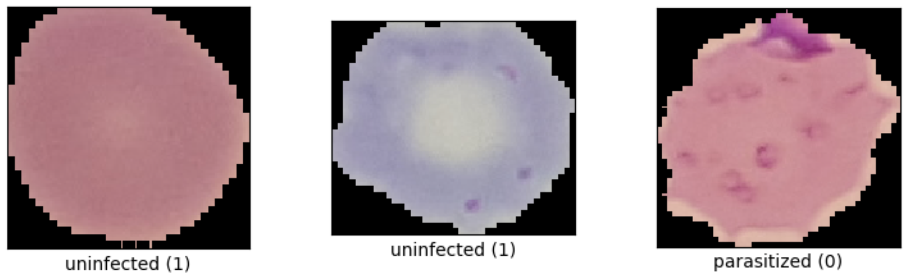
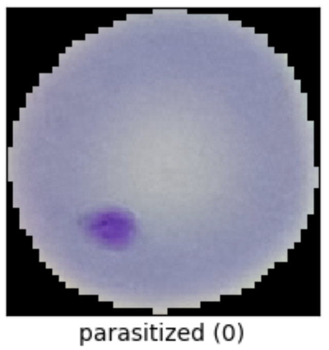
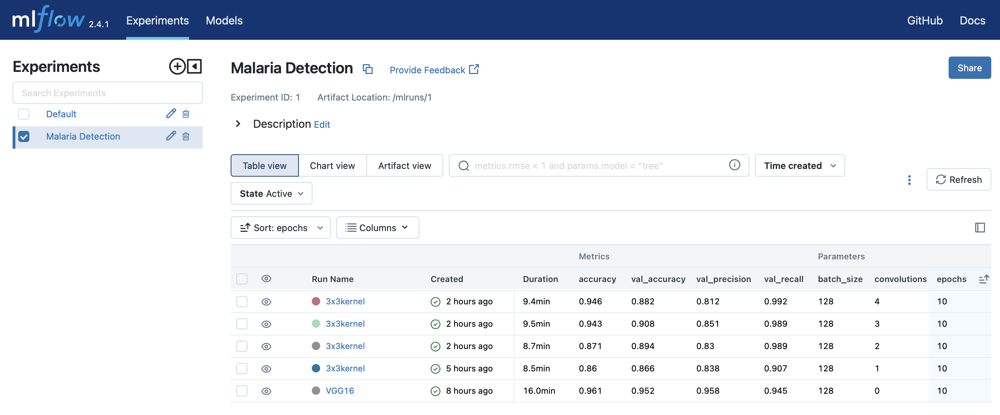
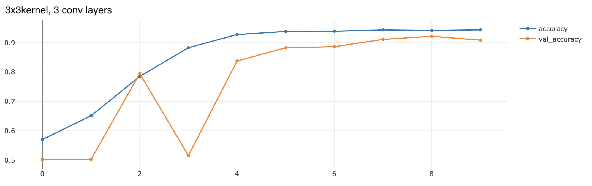
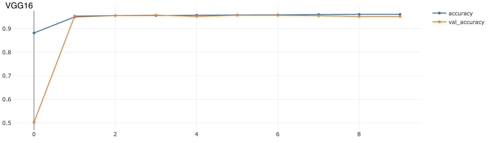

# py_tf2_gpu_dock_mlflow

_**Get new Python/Tensorflow/GPU models running quickly, and logging
performance and resulting model in MLflow, keeping everything in Docker via
MLflow Projects.**_

This [Python](https://www.python.org)/[Tensorflow2](https://www.tensorflow.org)
setup uses [MLflow](https://mlflow.org) with GPU runs in a
[Docker](https://www.docker.com) container to train, evaluate, and log models
to MLflow's model registry.  Logged models can then be easily served via
REST API or downloaded from the registry into python code or their own new
Docker image for further use.

The training computation itself is handled entirely in the container; for
that the host system only needs the Nvidia driver and Docker installed.
However, currently to kick off the training one still needs a Python
environment with MLflow installed (and a clone of this repo assuming you want
to make your own changes to the model or data).

The training script includes function definitions for loading training data
of different types (images from directory, tf-datasets, custom datafiles, etc)
and for the neural network specification, so those things are easily
experimented with independently of the rest of the code.  This repo's tools
spawns a Tensorflow model training in a self-contained Docker container with GPU
access and then logs its results and solution model into MLflow at the end so
one has a record of runs that can be compared.

In the default example implemented here, we use the 
[malaria](https://www.tensorflow.org/datasets/catalog/malaria)
detection dataset from the Tensorflow datasets to train/test a VGG166-based
image classification model to detect malaria parasite presence
in thin blood smear images.  A few options for alternate neural network
definitions are included in the code (see the `convolutions` parameter
which is actually "number of convolutional layers in the model").

## How to install/run

Note this repo has been written and tested assuming running on Linux.
It will almost surely will not work out of the box in Windows.

**Option #1:**  follow [this lowdown](doc/aws_ec2_install.md) to kick off a low-cost AWS GPU instance and use the aws_ec2_install.bash script to quickly set it up to run this py_tf2_gpu_dock_mlflow repo with the MLflow setup from the [docker_mlflow_db](https://github.com/aganse/docker_mlflow_db) repo (assuming you already have an AWS account).

**Option #2:**  follow the general approach here:

1. have GPU and Docker already working on your system (e.g. make sure [these checks](doc/check_gpu_docker.md) work).
2. have your MLFLOW_TRACKING_URI environment var pointing to a running MLflow 
   server, which must be running version 2+.  For example you might use a bash
   line like this to set that:
   `export MLFLOW_TRACKING_URI=http://localhost:5000`.  You might like to put
   that in your shell resource file (.bashrc for example).
3. either have your MLflow server's artifact storage directory accessible within 
   `/storage/mlruns` (noting that `/storage` is volume-mapped into the container - 
   see `MLproject` file), or your MLflow instance configured to hold everything in 
   S3.
4. have your data files accessible somewhere within `/storage` (which is 
   volume-mapped into the container - see `MLproject` file).  For example, for 
   this repo's default malaria problem the dataset is stored in `/storage/tfdata`.
4. git clone this repo, cd into it, create python env via `make env`
5. enter the python environment that was just made:  `source .venv/bin/activate`.
6. `make load_tfdata` (if using the default tf dataset shown in this readme) to
   download the data to /storage/tfdata.
8. then `make build` to create the training Docker container.
9. then `make run` (only this step actually requires the python env, just for 
   mlflow cli).  The first thing mlflow does on starting the run is to add the 
   latest state of the train script and other files on top of the image built from
   the Dockerfile.  For this reason the run may initially look like it's frozen 
   while one cpu is pegged at 100%; but it's building that new image which
   takes several minutes.
   The resulting new image takes the name of the one created by the `make build`
   command, appended with a hash-based label of the present git commit hash, 
   looking something like `<original_image_name>:4e23a5b`.
   
Note that `make run` just kicks off the `project_driver.bash` script.  It might
   be useful to know that once you've got the repo forked in your own account and
   updated to suit your needs, technically you don't even need to clone the repo 
   anymore to run your trainings - you can reference your repo URL or your
   pre-made remote docker image in the `mlflow run` command at the top of the 
   `project_driver.bash` script.  The
   [MLflow Projects](https://mlflow.org/docs/latest/projects.html) documentation
   has more about that; just something to think about.

Once the run is in progress, you should find metrics progress logging in your
MLFlow instance, something like this.  When you click on the metrics links in each run you can see plots over the epochs. 

We can see how the transfer-learned VGG16 model does better than the other models tried above, and how it converges faster.  It's not quite a fair comparison though, because the VGG16 run used transfer-learning to perturb pre-trained (Imagenet) weights for this problem, whereas the other (albeit smaller) models were trained from scratch.  You'll find in the `define_network()` function in `train.py` that some extra layers were added to the end of the VGG16 network; this was to allow exploring different variations in transfer-learning and fine-tuning.  Of course you can replace all that with whatever you wish.

Lastly: the `make run` macro runs the `project_driver.bash` shell script, but a 
Python script `project_driver.py` with mostly-corresponding functionality is 
left in here too from my experimentation.  However, importantly note:  as of this 
writing, while the python entry point allows to kick off multiple concurrent runs 
which is cool, it appears that GPU usage in Docker containers in MLFlow Projects 
can only be done if using the CLI (shell script) call to MLflow.  I.e. the shell
command `mlflow` finally now takes a `--gpus=all` argument, but the Python
`mlflow.projects.run()` method still does not have an equivalent yet.  That's 
strictly about an issue with MLflow, not with Python or Tensorflow or Docker.

## References

About this malaria detection problem:
* <https://www.tensorflow.org/datasets/catalog/malaria>
* <https://peerj.com/articles/4568/?ref=https%3A%2F%2Fgithubhelp.com>
* Rajaraman S, Antani SK, Poostchi M, Silamut K, Hossain MA, Maude RJ, Jaeger S,
  Thoma GR. 2018. Pre-trained convolutional neural networks as feature extractors
  toward improved malaria parasite detection in thin blood smear images.
  PeerJ 6:e4568 <https://doi.org/10.7717/peerj.4568>

About relevant Tensorflow details in particular:
* if updating versions, must match TF version to CUDA and python versions:
  <https://www.tensorflow.org/install/source#gpu>
* <https://www.tensorflow.org/install/docker>
* <https://www.tensorflow.org/guide/keras/preprocessing_layers>
* <https://www.tensorflow.org/api_docs/python/tf/keras/metrics>
* <https://www.tensorflow.org/tutorials/structured_data/imbalanced_data>
* <https://www.tensorflow.org/api_docs/python/tf/data/Dataset>
* <https://www.tensorflow.org/tutorials/load_data/images>
* <https://www.tensorflow.org/api_docs/python/tf/keras/utils/image_dataset_from_directory>

About additional computational tools used here (Docker, MLflow, etc):
* <https://towardsdatascience.com/create-reusable-ml-modules-with-mlflow-projects-docker-33cd722c93c4>
* <https://towardsdatascience.com/using-mlflow-to-track-and-version-machine-learning-models-efd5daa08df0>
* <https://santiagof.medium.com/effortless-models-deployment-with-mlflow-2b1b443ff157>
* <https://towardsdatascience.com/step-by-step-vgg16-implementation-in-keras-for-beginners-a833c686ae6c#:~:text=VGG16%20is%20a%20convolution%20neural,vision%20model%20architecture%20till%20date.>
* <https://cosminsanda.com/posts/experiment-tracking-with-mlflow-inside-amazon-sagemaker>
* <https://stackoverflow.com/questions/48309631/tensorflow-tf-data-dataset-reading-large-hdf5-files>
* <https://github.com/tensorflow/io/issues/174>  (looks like TF-IO has built-in HDF5 reader?)

The code and setup were initially based on [George Novack's 2020 article in
Towards Data Science, "Create Reusable ML Modules with MLflow Projects & Docker"](
https://towardsdatascience.com/create-reusable-ml-modules-with-mlflow-projects-docker-33cd722c93c4)
(thank you).  I've pulled things together into a single repo meant to use as a
template, added some new functionality (artifact logging, model registry, GPU
capability), and generalized it a bit.
