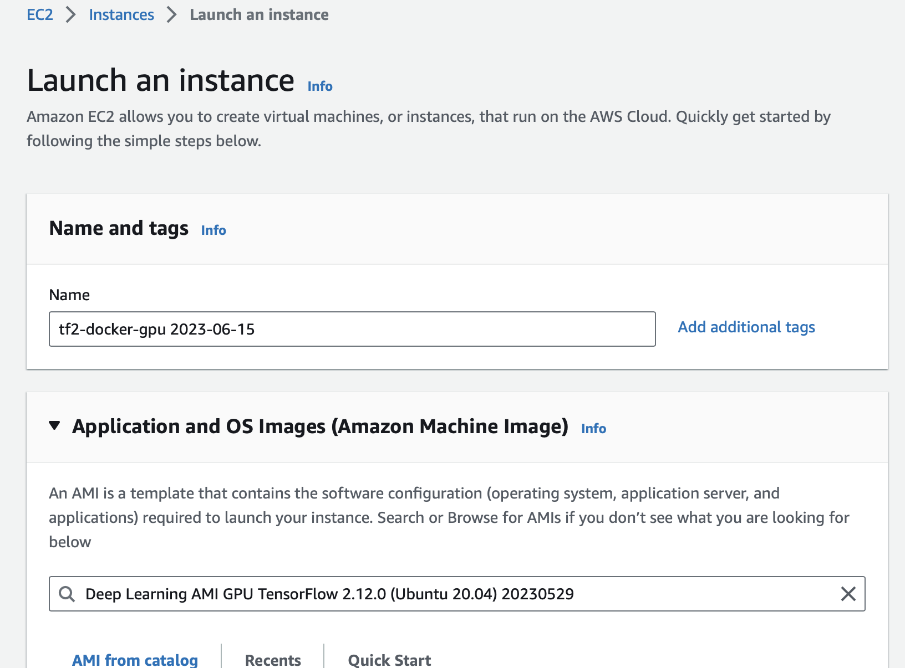

### Get this stuff running quickly on AWS
Here are step-by-step instructions to kick off a low-cost AWS GPU instance and use the aws_ec2_install.bash script to quickly set it up to run this py_tf2_gpu_dock_mlflow repo with the MLflow setup from the docker_mlflow_db repo (assuming you already have an AWS account).

1. The following assumes you already have an AWS account and at least know basic navigation within it to follow these instructions - just take a quick read below to make sure before launching into things.

2. In EC2 section of your AWS account, click the Launch Instances button.

3. Under "Name and tags" choose any arbitrary name for your instance; I like to add a date into my instance names to keep track of things.

4. Under "Application and OS Images" choose the following pre-made Deep Learning AMI (so that an NVIDIA driver and Docker is conveniently already installed) by pasting the following into the AMI search box:  **Deep Learning AMI GPU TensorFlow 2.12.0 (Ubuntu 20.04) 20230529**, hitting enter, and then clicking the Select button.

5. Under "Instance Type" choose **g4dn.xlarge**, which as of this writing has NVIDIA T4 GPU, Intel CPU, \$0.58/hour for Ubuntu, 4 vCPU, 16GiB.  For the minimal default malaria example in this repo I recommend this smallest GPU instance.  Of course for your own modeling you can gradually increment upwards from there if you find you need to - just note the balance between more hours training on a cheaper instance vs. fewer hours training on a more expensive instance.

    <small>N.B., I have blown a ridiculous amount of time trying to get AWS's new (slightly cheaper) Graviton ARM-based instances running with setups like this involving a pre-made AMI with pre-made images of Python, Tensorflow, Docker, and MLflow.  The pre-made images for the Tensorflow+Docker+Python combo already put things behind the times and I think with that the ARM support is just too new for that approach.  So for now, using this repo implies you must **stick with Intel/AMD based AWS instances**.  The ARM-based instances are slightly cheaper, but not by a lot.  By comparison, the nearest comparable ARM-based instance is g5g.xlarge, which has NVIDIA T4G GPU, ARM CPU, \$0.48/hour for Ubuntu, 4 vCPU, 8GiB ram; so slightly cheaper but not by a ton.  These GPU instances don't go less than the "xlarge" level.</small>

6. Under "Key pair (login)" either choose a pre-existing key pair (pem file) you already made before, or click "Create new key pair" (either RSA or ED25519 is ok) and choose .pem.  Make sure to download that pem file - you'll use it with ssh to log in.

7. Under "Network settings" if you haven't fussed with VPCs and Subnets before it should provide you with pre-filled workable defaults.  Otherwise you just need to make sure the VPC and Subnet you choose work together.
Choose "Create security group", click the "Allow SSH traffic from" checkbox, and choose the "My IP" option in its dropdown so that only you can log into this EC2 instance.

8. Under "Configure storage" choose **50GB of gp3 drive storage**.  This is enough for the example use-case with the malaria dataset, but for other larger datasets this may need to be more.  It’s a bit of trial and error - as a rule of thumb, look up the size of the uncompressed dataset first and add 40-50GB margin for the os and tools and built images.

9. All set - now click the Launch Instance button on the right side (which is a different launce instance button from before - the previous one gets you to this form screen, this one actually does launch the instance you specified in the form).

10. It'll be a minute while the instance boots up - on the instances list you'll find yourself in look for the instance name you entered up in #3, and click its checkbox.  Once it has completed its startup then the Connect button at top will be activated; click that and in the ensuing screen click the "SSH Client" tab.  Copy/paste the command line on that screen to your terminal, but with one addition: add a `-L 4999:localhost:5000` before the `-i` ssh-key argument.  This will make mlflow accessible in your web-browser at `http://localhost:4999`.

11. Use `vi` to create/open a new script file `aws_ec2_install.bash` in the home directory, and paste into it the contents of the `aws_ec2_install.bash` file in this repo.  (Since you can't clone the repo in there yet!)  On the saved file, run `chmod +x aws_ec2_install.bash` to make it executable.

12. Run that script via `./aws_ec2_install.bash` and this will set up the rest for you.  In the middle of that run it will pause so you can copy/paste your newly created ssh public key into your GitHub account so that you can clone the needed repos.

13. Now go to `http://localhost:4999` in your local web-browser and you should see the MLflow screen.

14. Now `cd src/python/py_tf2_gpu_dock_mlflow` and run `make build`.  This will take several minutes and build the docker image for training.

15. Now `source .venv/bin/activate` and `make run`.  The training of the default malaria example should crank up.  If you log into your ec2 again in a second terminal window, you can run `nvidia-smi` to confirm the GPU is being used (but without it the training in the first window would look like nothing is happening).  Also while the training is in progress you can go into the run-in-progress in MLflow, click on one of the metrics, and the plot of that metric over iterations will update.

16. The default VGG16-based malaria detector training should take about 16min on that instance, after which its results will change to "Finished" status in MLflow.  Yay!  🎉
